# 科研兴盛度观测站

用年度曲线同时观察全球科研产出、顶刊质量、增长动量与社会关注度，并支持工程学和计算机科学子领域拆解。

在线访问：[research-prosperity-pulse.gaocherrr.chatgpt.site](https://research-prosperity-pulse.gaocherrr.chatgpt.site/)

## 运行时截图

### 全球科研领域总览

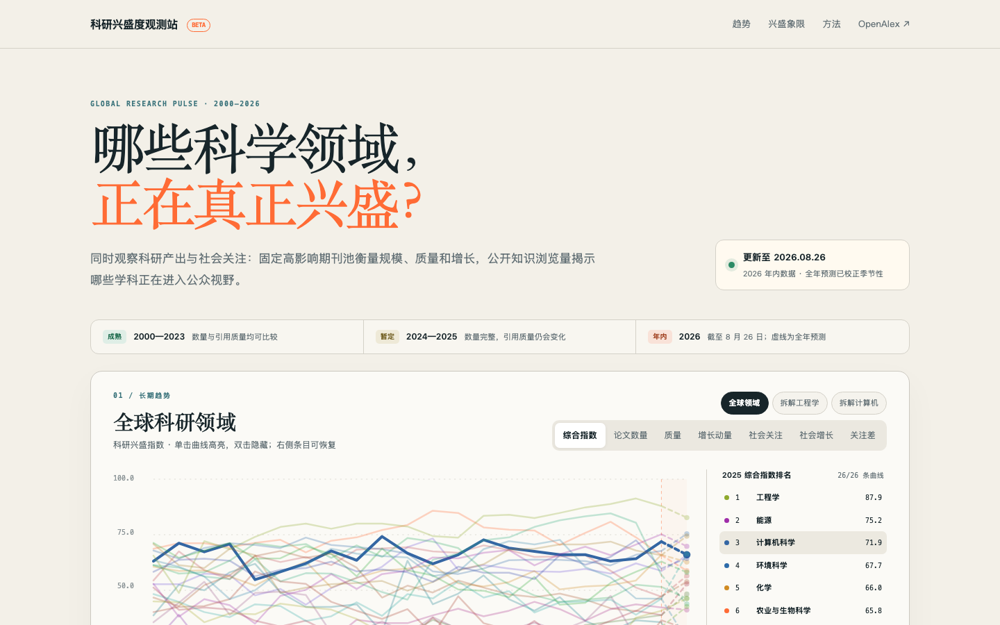

### 全部指标图表

| 综合指数 | 论文数量 |
| --- | --- |
| 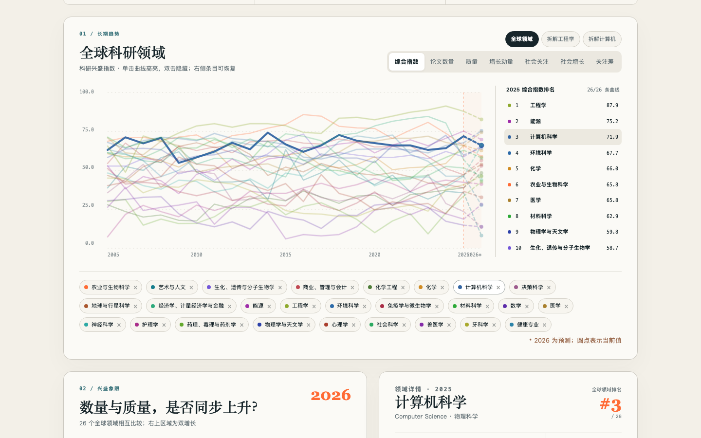 | 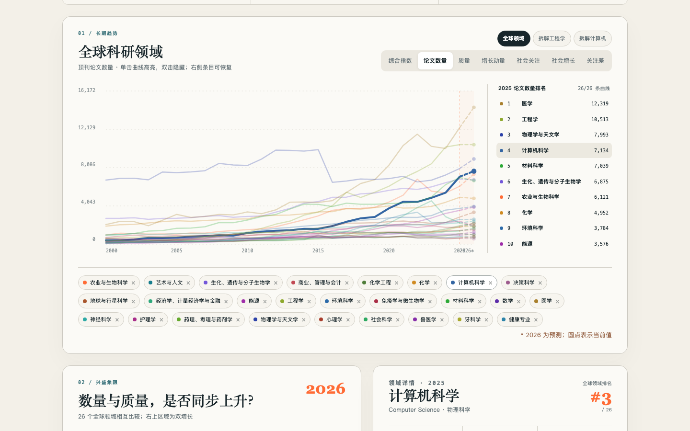 |

| 质量 | 增长动量 |
| --- | --- |
| 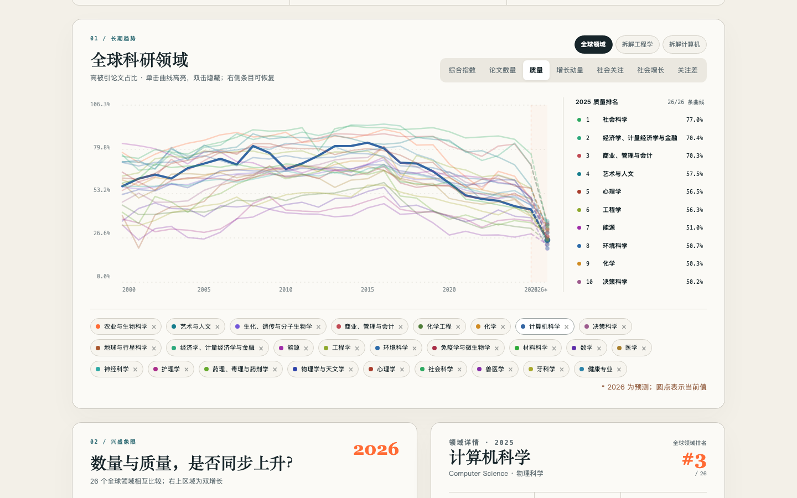 | 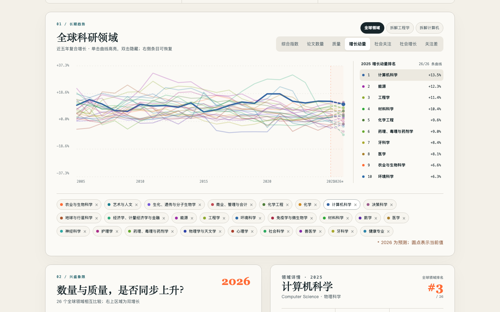 |

| 社会关注 | 社会增长 |
| --- | --- |
| 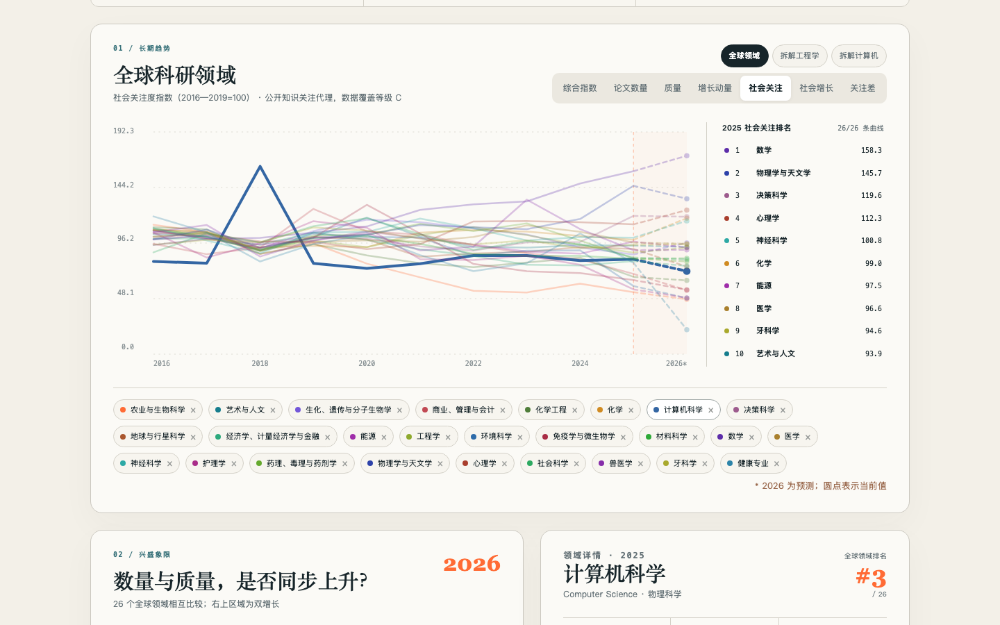 | 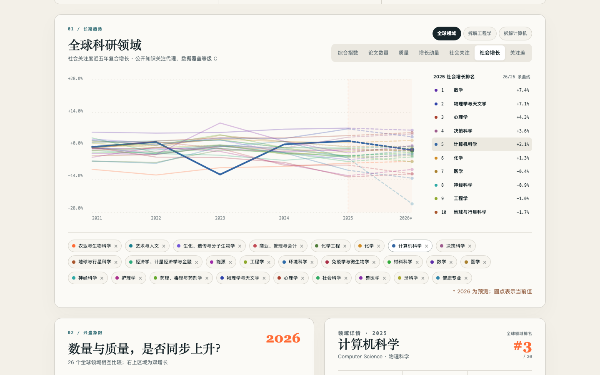 |

#### 关注差

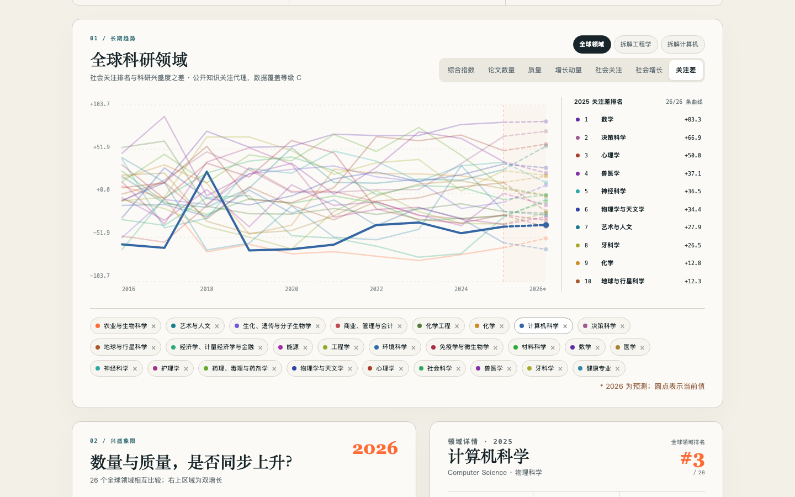

### 子领域与详细视图

| 工程学：论文数量 | 工程学：社会关注 |
| --- | --- |
| 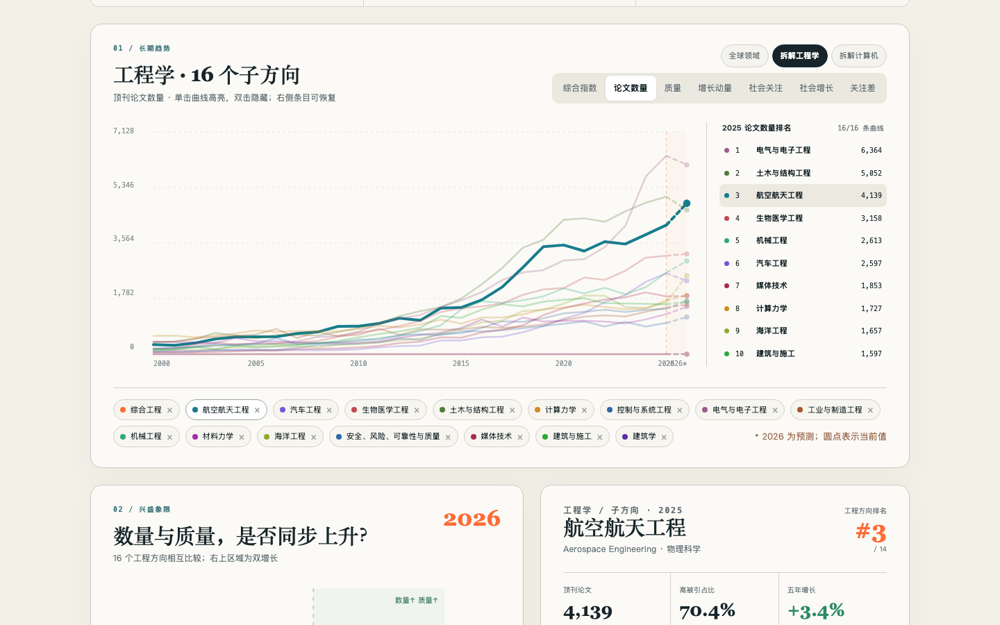 | 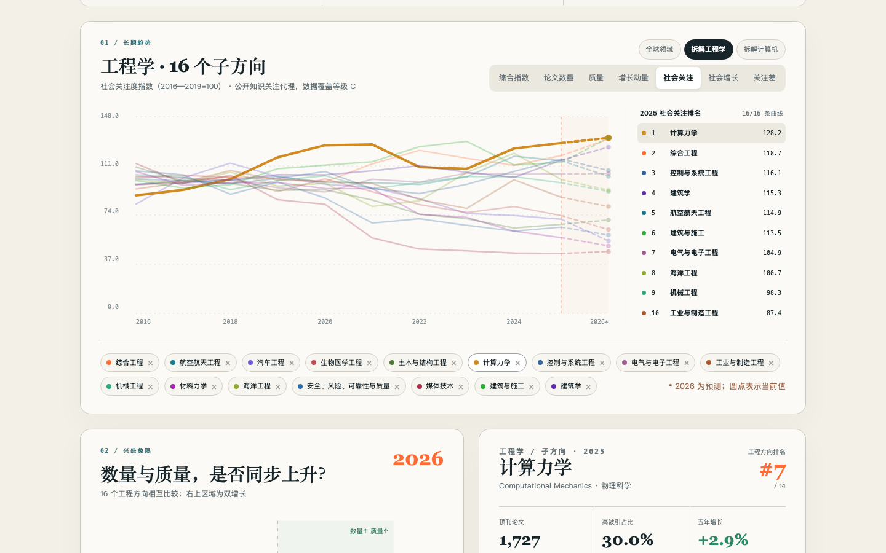 |

| 计算机科学子方向 | 兴盛象限与领域详情 |
| --- | --- |
| 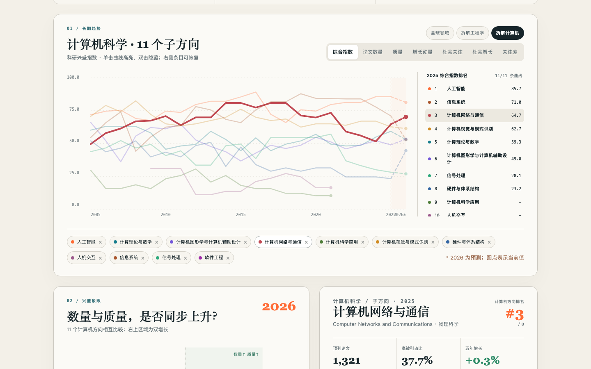 | 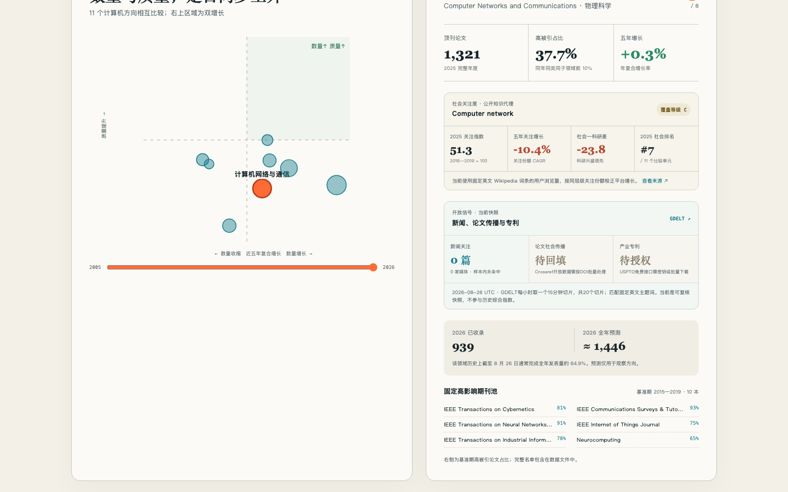 |

## 功能概览

- 展示 2000—2026 年科研兴盛度年度曲线，2026 年数据以虚线标识为年内预测。
- 支持综合指数、论文数量、质量、五年增长、社会关注、社会增长与关注差切换。
- 工程学拆分为 16 个子方向，计算机科学也提供更细粒度的子领域视图。
- 单击曲线高亮，双击隐藏；图例中的已隐藏方向可以随时恢复。
- 社会关注度以公开搜索、新闻和社区知识信号为代理，并标注数据覆盖等级。

## 数据与方法

论文产出和引用数据主要来自 [OpenAlex](https://openalex.org/)。指标按年度聚合，并对不同量纲进行标准化后形成综合指数。近年引用质量存在成熟期，2026 年属于年内数据，因此界面会对预测段和数据覆盖情况进行单独标记。

## 本地运行

```bash
npm install
npm run dev
```

生产构建：

```bash
npm run build
```
